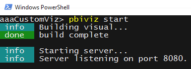
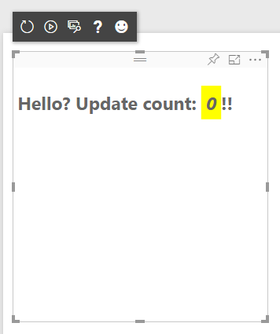

#PowerBI Visual Tools (pbiviz)

The easiest way to create custom visuals is by using the PowerBI command line tools which can be easily to installed via NPM. The command line tools provide everything you need to develop visuals and test them in live PowerBI reports and dashboards. 

**Features:**

* Visual project generation
* TypeScript compilation
* Less compilation
* Automatic live reload
* pbiviz packaging (for distribution

##Basic Setup

Before you can get started you'll need to install the tools. This should only take a few seconds.

####Dependencies

Before you can run (or install) the command line tools you must install NodeJS.

* NodeJS 4.0+ Required (5.0 recommended) - [Download NodeJS](https://nodejs.org)


####Installation

To install the command line tools simply run the following command

```
npm install -g pbiviz
```

To confirm it was installed correctly you can run the command without any paremeters which should display the help screen.

```
pbiviz
```

-----------

##Creating a new visual

You can create a new visual project with a single command.

```
pbiviz new My Visual Name
```

Replace "My Visual Name" with the name of your visual. You can change this later by modifying the generated `pbiviz.json` file.

This command will create a new folder in your current directory and generate a basic starter template for your visual. Once it finishes you can open the directory and use your favorite editor to start working on your new visual.

[Learn more about writing custom visuals](https://github.com/microsoft/powerbi-visuals-contracts/tree/master/Docs) 

-----------

##Testing your visual in PowerBI

You can easily test your visual live in reports and dashboards in the PowerBI service

####Server certificate setup

To enable live preview visual assets need to be served on a trusted https server so before you can start you need to install an ssl certificate which will allow visual asssets to load in your web browser. This is a one time setup.

* [How to install the local SSL certificates](docs/CertificateSetup.md) 

####Running your visual

To run your visual navigate to the root of your visual project (the directory containing `pbiviz.json`) and type `pbiviz start` to build and serve the visual.



This command will compile your [typescript](http://www.typescriptlang.org/) and [less](http://lesscss.org/) files and bundle them for testing. It also launches an https server that will serve your visual for testing in your favorite web browser.

####Enable developer visual

To view/test your visual in PowerBI you need to enable the development visual and then you can add it to any report.

* [How to enable the developer visual in PowerBI](docs/DebugVisualSetup.md)

####Viewing your visual in PowerBI

 

####Toolbar icons (left to right)

* **Refresh Visual** - Manually the visual (if auto reload is off)
* **Toggle Auto Reload** - When turned on the visual will automatically update every time you save a file
* **Log DataView** - Outputs the dataview in it's current state to the browser's console
* **Get Help** - Links to this documentation
* **Send Feedback** - We're always trying to improve the experience so let us know about yours 

-----------

##Packaging your Visual for distribution

Before you can load your visual into [PowerBI Desktop](https://powerbi.microsoft.com/en-us/desktop/) or share it with the community in the [PowerBI Visual Gallery](https://visuals.powerbi.com) you'll need to generate a `pbiviz` file.

To package your visual navigate to the root of your visual project (the directory containing `pbiviz.json`) and use the following command to generate a pbiviz file.

```
pbiviz package
```

This command will create a pbiviz file in the `dist/` directory of your visual project. If there is already a pbiviz file (from previous package operations) it will be overwritten.

-------------

##Contributing

If you would like to contribute please see [How To Contribute](CONTRIBUTING.md).