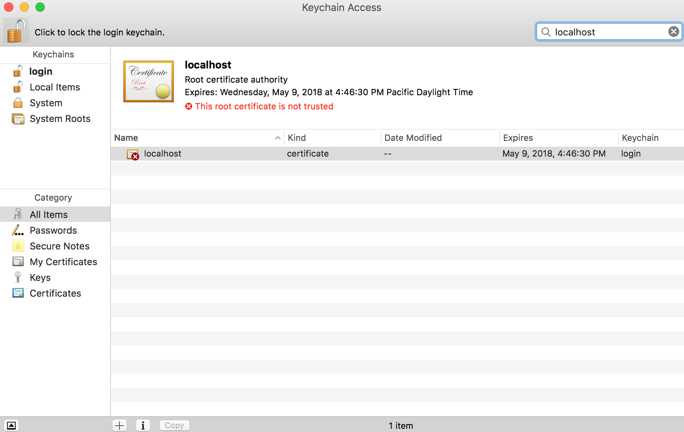
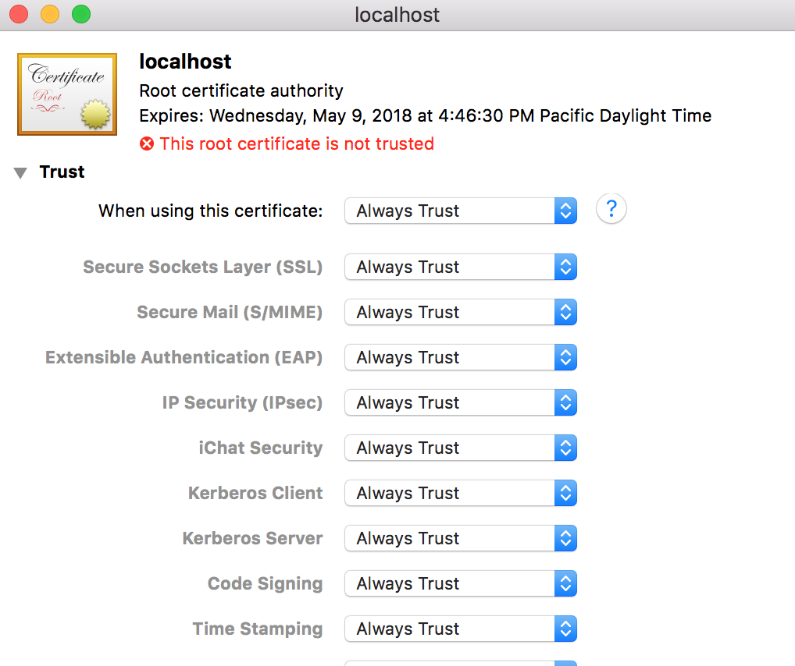
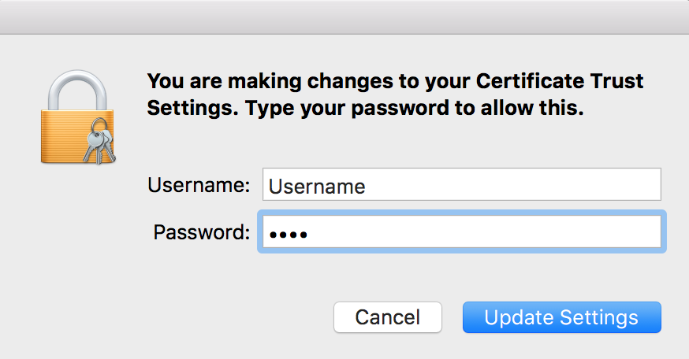

#Add Certificate (OSX)

To be access your visual through PowerBI you need to add a trusted certificate for localhost. This will allow PowerBI to load the visual assets in your browser without a security warning.

----------

###Step 1

Run the following command to open the certificate and start the process.

```
pbiviz --install-cert
```

*If this command fails for some reason find pbiviz in your global node modules folder and open the certificate manually.*

----------

###Step 2



* If the lock (top left corner) is locked click it to unlock 
* Enter "localhost" in the search box (top right corner)
* Double click on the new certificate

----------

###Step 3



* Select `Always Trust`
* Close the window

----------

###Step 4



* Enter your username / password
* Click `Update Settings`

----------

###Step 5

**Close all open browsers**

Once this is done your browser will trust this certificate for connections to `localhost` which will allow you to serve visuals. You will need to close all open web browsers before changes will take effect. If this doesn't work try restarting your computer.