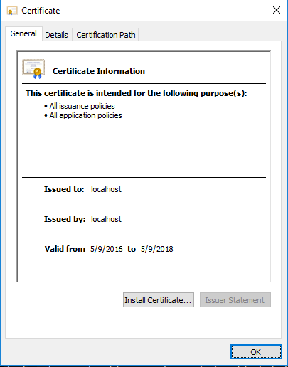
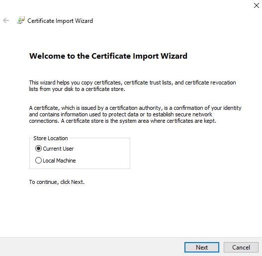
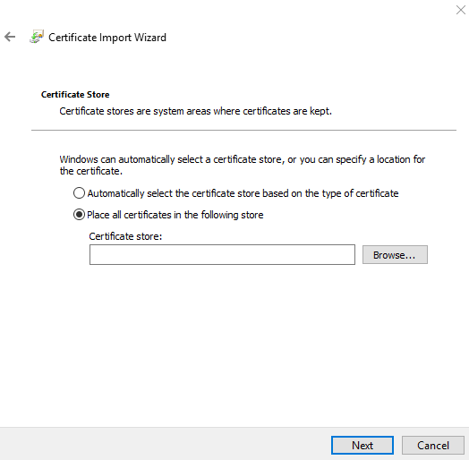
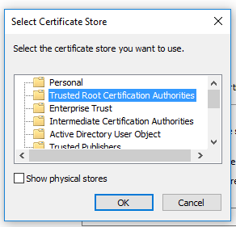
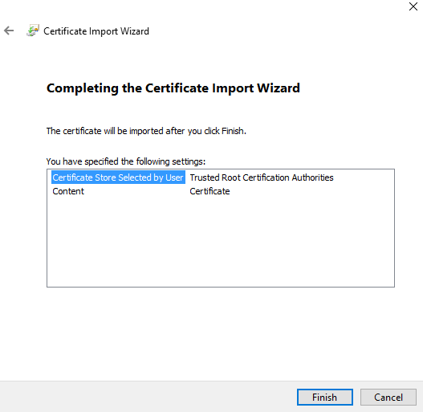
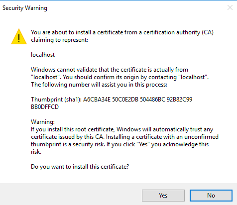

#Add Certificate (Windows)

To be access your visual through PowerBI you need to add a trusted certificate for localhost. This will allow PowerBI to load the visual assets in your browser without a security warning.

----------

###Step 1

Run the following command to open the certificate and start the process.

```
pbiviz --install-cert
```

*If this command fails for some reason find pbiviz in your global node modules folder and open the certificate manually.*

----------

###Step 2



* Click `Install Certificate...`

----------

###Step 3



* Select `Current User` and click `Next`

----------

###Step 4



* Select `Place all certificates in the following store`
* Click `Browse...`

----------

###Step 5

You should see this dialog



* Select `Trusted Root Certification Authorities`
* Click `OK`
* Click `Next` *(previous screen)*

----------

###Step 6



* Click `Finish`

----------

###Step 7

You will then see this security warning



* Click `Yes`

----------

###Step 8

**Close all open browsers**

Once this is done your browser will trust this certificate for connections to `localhost` which will allow you to serve visuals. You will need to close all open web browsers before changes will take effect. If this doesn't work try restarting your computer.