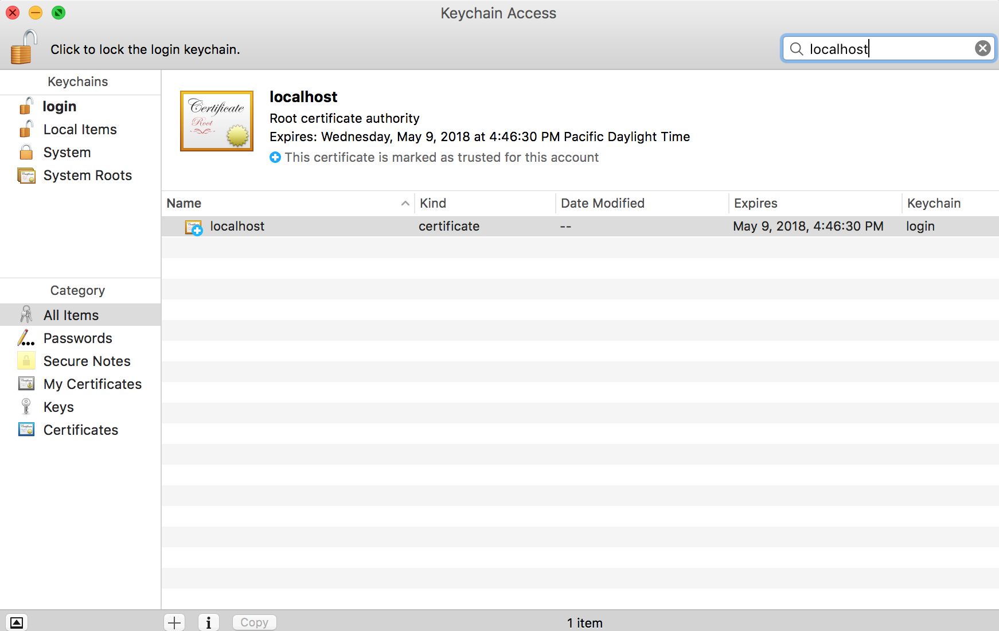
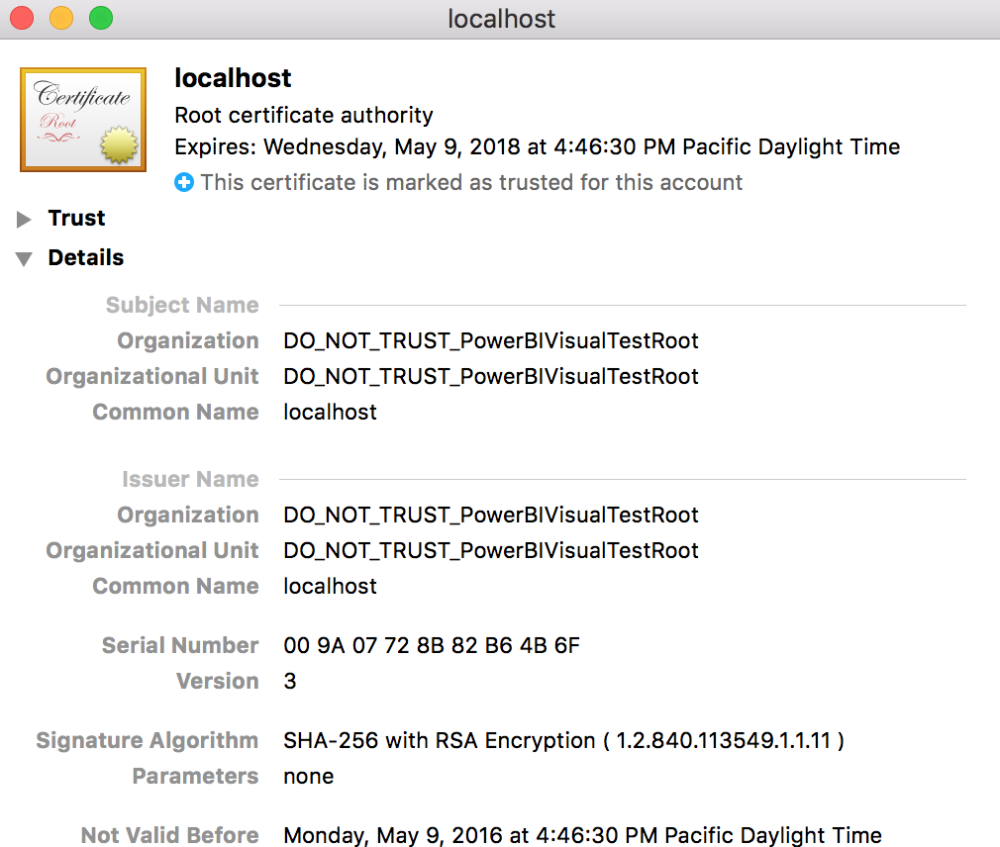
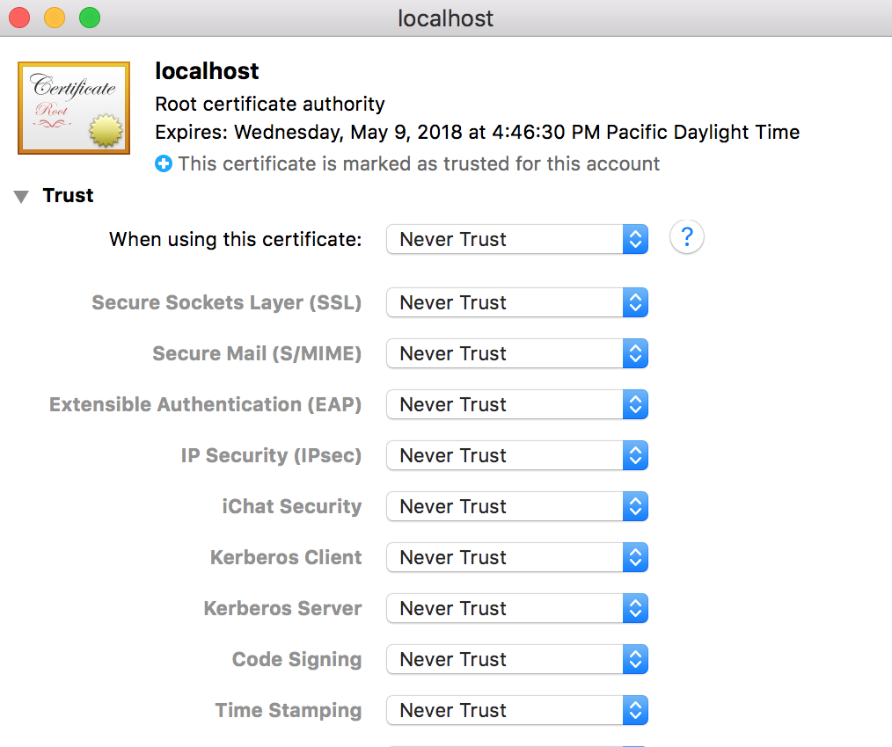

#Remove Certificate (OSX)

If you are no longer using the PowerBI Custom Visual CLI tools you should remove the certificate from your system.

----------

###Step 1

* Open `Spotlight Search` (cmd+spacebar)
* Type "keychain"
* Hit enter or click on "Keychain Access"

----------

###Step 2

* If the lock (top left corner) is locked click it to unlock 
* Enter "localhost" in the search box (top right corner)
* Double click on the new certificate

----------

###Step 3

* Look inside the `Details` section
* Check the details to ensure it's the correct certificate

----------

###Step 4

* Look inside the `Trust` section
* Select `Never Trust` 
* Close the window

----------

###Step 4

* Enter your username / password
* Click `Update Settings`

----------

###Step 5

**Close all open browsers**

Once this is done your browser will stop trusting this certificate for connections to `localhost`.