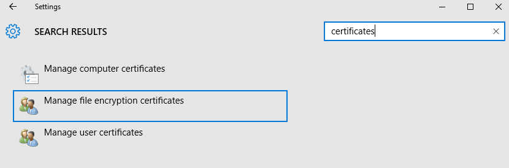
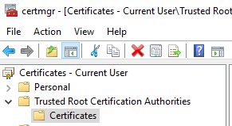
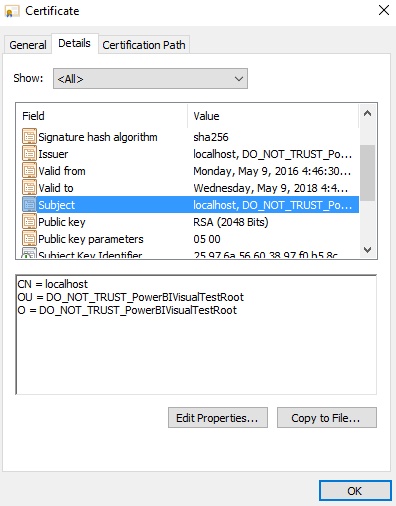
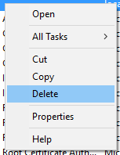

#Remove Certificate (Windows)

If you are no longer using the PowerBI Custom Visual CLI tools you should remove the certificate from your system.

----------

###Step 1

* Open Settings
* Type "certificates"
* Click `Manage User Certificates`

----------

###Step 2

* Look under `Trusted Root Certificate Authorities` (list on left) 
* Select `Certificates

----------

###Step 3

* double click `localhost` in the list

----------

###Step 4

* Check the details to ensure it's the correct certificate
* Close the window

----------

###Step 5

* Back in the main search window
* Right click `localhost`
* Select `Delete`

----------

###Step 6

**Close all open browsers**

Once this is done your browser will stop trusting this certificate for connections to `localhost`.