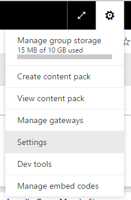
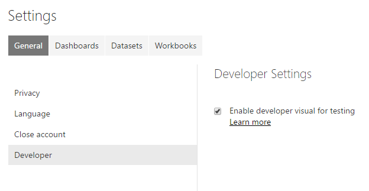
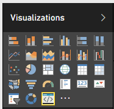

#Developer Visual Setup

To enable live preview of your custom visual follow these steps

----------

###Step 1

* Go to `Settings` in the gear menu

----------

###Step 2

* Click on `Developer`
* Check the `Enable developer visual for testing` checkbox

----------

###Step 3

* Select the `Developer Visual` in the Visualizations pane

----------

###Step 4

* Select the visual in the report canvas
* Bind data like normal
* Begin developing your visual (make sure you've `pbiviz start` is running)
